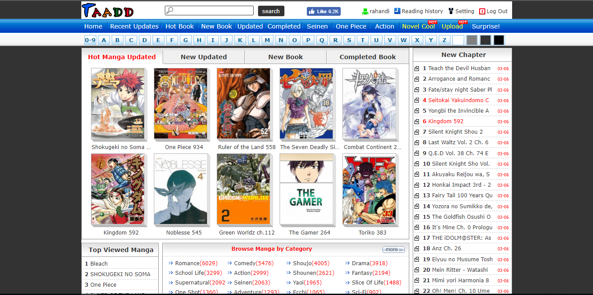
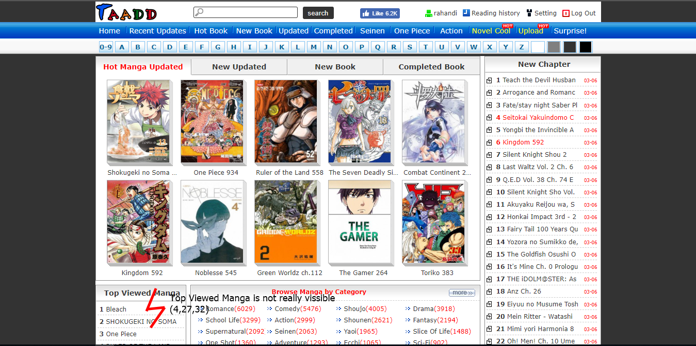
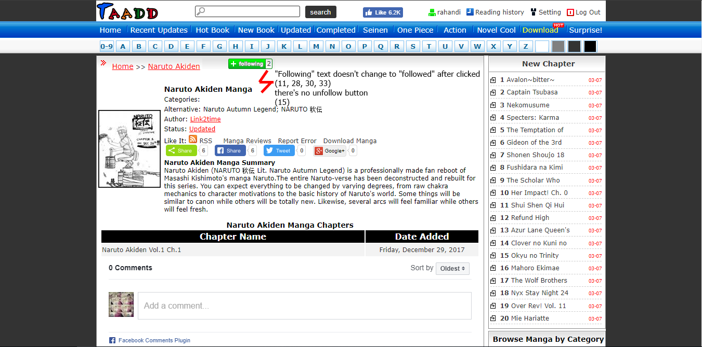
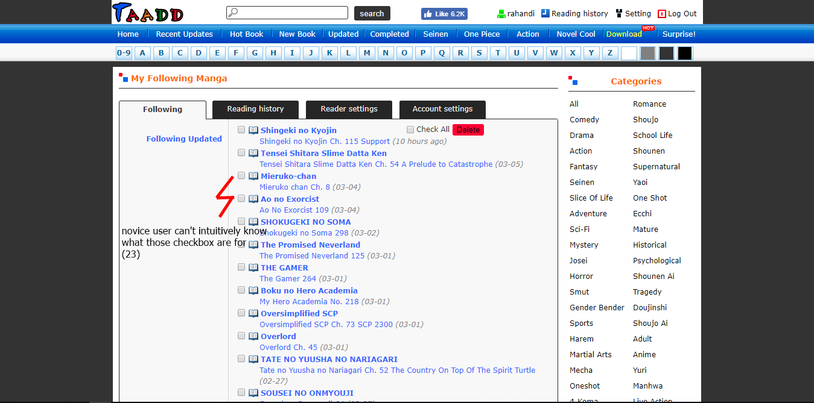

# Contextual Inquiry and Analysis
## Device/ App/ Website Description

Taad (taadd.com) is a online manga reader site that allow everyone to read manga without having to have the physical manga. Registered user are also able to bookmark their favorite manga.
## Instruction Script
There's 4 sequential task were observed:
1. Open taadd.com
2. Search for "Naruto" manga
3. Follow the manga
4. Unfollow the manga
## User Description
- Female
- 21 years old
- Student of Statistic Department ITS
- Always connected to Internet
- Only use internet for social media
- Had no experience with Taadd
## Transcript
1. saya: buka web taadd
1. bukan saya: manga?
1. saya: iya, terus buka naruto
1. (beberapa detik digunakan untuk mencari manga naruto)
1. bukan saya: whats???, naruto yang mana?
1. saya: yawes seng endi ae, naruto pokok'e
1. bukan saya: serius yang ini?
1. saya: iya wes
1. bukan saya: kan naruto yang penting
1. saya: terus coba follow
1. bukan saya: followingnya 0, terus nambah 1
1. saya: iku wes ke-follow kan?
1. bukan saya: sudah
1. saya: saiki coba unfollow
1. bukan saya: dimana unfollownya....
1. saya: nemu ga?
1. bukan saya: gak enek cuy
1. saya: coba buka'en seng profile
1. bukan saya: lapo kok malah ndek kene, ga nyambung
1. saya: tempat unfollow'e ndek situ, cariono
1. bukan saya: hmmm...., following updates?
1. saya: opo iku?
1. bukan saya: gak ngerti, mana unfollownya?, oh iki dicentang?, ya?
1. saya: paling...
1. bukan saya: terus delete iki
1. saya: coba cek bener ke-unfollow ga?
1. (beberapa detik digunakan untuk mencari manga naruto)
1. bukan saya: loh kok following'e sek 1
1. saya: coba follow maneh terus unfollow maneh
1. bukan saya: loh kok iso ngefollow 2 kali
1. saya: coba unfollow maneh
1. (beberapa detik digunakan untuk mencari manga naruto)
1. saya: loh tetep 2
1. bukan saya: iki gak ke-unfollow ta?
1. saya: berarti memang web'e bermasalah
## Models and Annotations
### Artifact Model

### Flow Model

### Cultural Model

## Do's and Don't's
Fusce lobortis massa mauris, in aliquam erat aliquet eget. Donec rhoncus venenatis mauris, at commodo odio bibendum ac. Sed consectetur enim justo, vitae maximus eros elementum non. Sed feugiat orci sem, vel faucibus sem aliquet sed. Praesent pulvinar felis eget nisl varius, id lacinia urna pretium. Sed at ornare diam, nec fringilla dolor. In ut gravida sapien, eget varius magna. Morbi lobortis ex eu eleifend finibus. Phasellus eget nulla ullamcorper, ullamcorper purus ac, luctus turpis. Sed volutpat mauris ut erat consectetur, in sagittis erat egestas.
